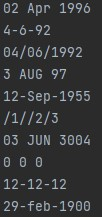
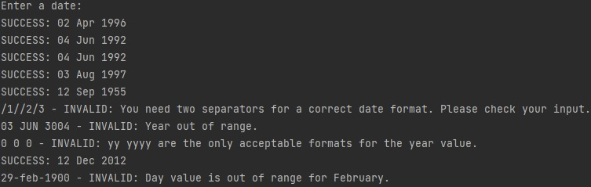

# Date Input Validation

This application can be used to type different formats of dates as input to check whether they are valid given that the input is satisfies certain constraints. A verbose error is also given for invalid input so the user can see (hopefully) where they went wrong. Leap years have been accounted for.

**Constraints:**

* Date is between the years 1753 and 3000.
* Dates are presented as `day month year`.
    * dd *or* d *or* 0d
    * mm *or* m *or* 0m *or* first three letters of the month name
    * yy *or* yyyy
* Three letter month abbreviations will either be all in the same case or only the first letter uppercase.
* Separator: - *or* / *or* \<space>.
* Only *one* separator type to be used in one date.

**Extra Notes:**

* If the year is written with two digits, the date lies between 1950 and 2049. E.g., 65 means 1965 and 42.
* 29th of February is only considered a valid date in leap years.

## How to Run
**Linux:**

`javac Dates.java`

`java Dates` *or* `java Dates < test-cases.txt`

**PowerShell:**

`javac Dates.java`

`java Dates` *or* `Get-Content test-cases.txt | java Dates`

## Examples
| input | output |
| --- | --- |
| | |
